# Ve230 - Electromagnetics

Author: Minjie Mao 

Time: 2021 Summer

Text book: Field and Wave Electromagnetics

## 1. Vector Analysis

### 1.1 Products of Three Vectors

- **Scalar triple product**

$$
\mathbf{A} \cdot(\mathbf{B} \times \mathbf{C})=\mathbf{B} \cdot(\mathbf{C} \times \mathbf{A})=\mathbf{C} \cdot(\mathbf{A} \times \mathbf{B})
$$
- **Vector triple product**
~
$$
\mathbf{A} \times(\mathbf{B} \times \mathbf{C})=\mathbf{B}(\mathbf{A} \cdot \mathbf{C})-\mathbf{C}(\mathbf{A} \cdot \mathbf{B})
$$
​		It is known as **"back-cab"**rule. (**BAC-CAB**)
$$
(\mathbf{A} \times\mathbf{B}) \times \mathbf{C}=\mathbf{B}(\mathbf{A} \cdot \mathbf{C})-\mathbf{A}(\mathbf{B} \cdot \mathbf{C})
$$

### 1.2 Orthogonal Coordinate Systems

- **Cartesian Coordinates**

$$
\left(u_{1}, u_{2}, u_{3}\right)=(x, y, z)
$$

$$
\mathbf{A}=\mathbf{a}_{x} A_{x}+\mathbf{a}_{\mathbf{y}} A_{y}+\mathbf{a}_{z} A_{z}
$$

- **Cylindrical Coordinates**

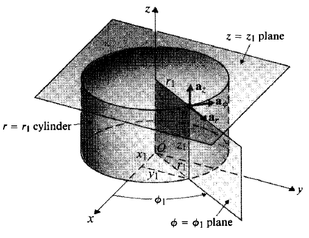

$$
\left(u_{1}, u_{2}, u_{3}\right)=(r, \phi, z)
$$

$$
\mathbf{A}=\mathbf{a}_{\boldsymbol{r}} A_{\boldsymbol{r}}+\mathbf{a}_{\phi} A_{\phi}+\mathbf{a}_{\mathbf{z}} \boldsymbol{A}_{z}
$$
- **Spherical Coordinates**

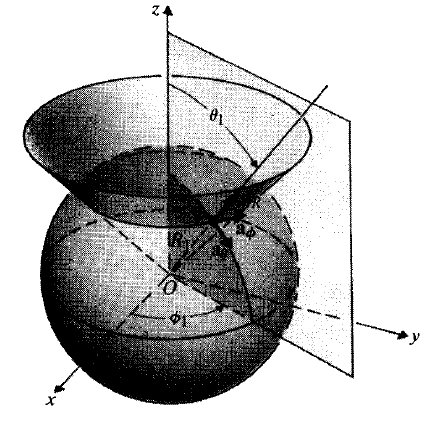

$$
\left(u_{1}, u_{2}, u_{3}\right)=(R, \theta, \phi)
$$

$$
\mathbf{A}=\mathbf{a}_{\boldsymbol{R}} A_{R}+\mathbf{a}_{\theta} A_{\theta}+\mathbf{a}_{\phi} A_{\phi}
$$

- **Matric Coefficients**

|                         | $h_1$ | $h_2$     |  $h_3$|
| :---------------------- | :---: | :--: | :--------: |
| **Cartesian Coordinates** | 1 | 1 | 1 |
| **Cylindrical Coordinates** | 1 | r | 1 |
| **Spherical Coordinates** | 1 | $R$ | $R \sin \theta$ |

$$
d \vec{\ell}=\mathbf{a}_{u_{1}}\left(h_{1} d u_{1}\right)+\mathbf{a}_{u_{2}}\left(h_{2} d u_{2}\right)+\mathbf{a}_{u 3}\left(h_{3} d u_{3}\right)
$$

$$
d s_{1}=h_{2} h_{3} d u_{2} d u_{3}
$$

$$
d v=h_{1} h_{2} h_{3} d u_{1} d u_{2} d u_{3}
$$

- **Coordinate transformation**

$$
\begin{array}{ll}
\hat{R} \cdot \hat{x}=\cos \varphi_{0} \sin \theta_{0} & \hat{\theta} \cdot \hat{x}=\cos \phi_{0} \cos \theta_{0} & \hat{\phi} \cdot \hat{x}=-\sin \phi_{0} \\
\hat{R} \cdot \hat{y}=\sin \varphi_{0} \sin \theta_{0} & \hat{\theta} \cdot \hat{y}=\sin \phi_{0} \cos \theta_{0} & \hat{\phi} \cdot \hat{y}=\operatorname{cos} \phi_{0} \\
\hat{R} \cdot \hat{z}=\cos \theta_{0} & \hat{\theta} \cdot \hat{z}=-\sin \theta_{0} & \hat{\phi} \cdot \hat{z}=0
\end{array}
$$

### 1.3 Gradient of a Scalar Field

We define the vector that represents both the magnitude and the direction of the maximum space rate of increase of a scalar as the gradient of that scalar.
$$
\nabla V \triangleq \mathbf{a}_{n} \frac{d V}{d n}
$$
The directional derivative along $d \ell$ is 
$$
\begin{aligned}
\frac{d V}{d \ell} &=\frac{d V}{d n} \frac{d n}{d \ell}=\frac{d V}{d n} \cos \alpha \\
&=\frac{d V}{d n} \mathbf{a}_{n} \cdot \mathbf{a}_{\ell}=(\mathbf{\nabla} V) \cdot \mathbf{a}_{\ell}
\end{aligned}
$$

$$
d V=(\mathbf{\nabla} V) \cdot d \ell
$$

Formula for calculating gradient
$$
\nabla V=\mathbf{a}_{u_{1}} \frac{\partial V}{h_{1} \partial u_{1}}+\mathbf{a}_{u_{2}} \frac{\partial V}{h_{2} \partial u_{2}}+\mathbf{a}_{u_{3}} \frac{\partial V}{h_{3} \partial u_{3}}
$$

### 1.4 Divergence of a Vector Field

We define the divergence of a vector field A at a point as the net outward flux of A per unit volume as the volume about the point tends to zero:
$$
\operatorname{div} \mathbf{A} \triangleq \lim _{\Delta v \rightarrow 0} \frac{\oint_{s} \mathbf{A} \cdot d \mathbf{s}}{\Delta v}
$$

$$
\mathbf{\nabla} \cdot \mathbf{A} \equiv \operatorname{div} \mathbf{A}
$$

$$
\nabla \cdot \mathbf{A}=\frac{1}{h_{1} h_{2} h_{3}}\left[\frac{\partial}{\partial u_{1}}\left(h_{2} h_{3} A_{1}\right)+\frac{\partial}{\partial u_{2}}\left(h_{1} h_{3} A_{2}\right)+\frac{\partial}{\partial u_{3}}\left(h_{1} h_{2} A_{3}\right)\right]
$$

**Divergence theorem**

The volume integral of the divergence of a vector field equals the total outward flux of the vector through the surface that bounds the volume.
$$
\int_{V} \mathbf{\nabla} \cdot \mathbf{A} d v=\oint_{S} \mathbf{A} \cdot d \mathbf{s}
$$

### 1.5 Curl of a vector field

The curl of a vector field is a vector whose magnitude is the maximum net circulation of A per unit area as the area tends to zero and whose direction is the normal direction of the area when the area is oriented to make the net circulation maximum.
$$
\nabla \times \mathbf{A}=\frac{1}{h_{1} h_{2} h_{3}}\left|\begin{array}{lll}
\mathbf{a}_{u_{1}} h_{1} & \mathbf{a}_{u_{2}} h_{2} & \mathbf{a}_{u_{3}} h_{3} \\
\frac{\partial}{\partial u_{1}} & \frac{\partial}{\partial u_{2}} & \frac{\partial}{\partial u_{3}} \\
h_{1} A_{1} & h_{2} A_{2} & h_{3} A_{3}
\end{array}\right|
$$

**Stokes's Theorem**

Surface integral of the curl of a vector field over an open surface is equal to the closed line integral of the vector along the contour bounding the surface.
$$
\int_{s}(\nabla \times \mathbf{A}) \cdot d \mathbf{s}=\oint_{C} \mathbf{A} \cdot d \ell
$$

### 1.6 Two Null Identities

$$
\begin{array}{l}
\nabla \times(\nabla V) \equiv 0
\end{array}
$$

$$
\nabla \cdot(\nabla \times \mathbf{A}) \equiv 0
$$

### 1.7 Helmholtz's Theorem

A vector field is determined to within an additive constant if both its divergence and its curl are specified everywhere.
$$
\mathbf{F}=-\nabla V+\nabla \times \mathbf{A}
$$

## 2. Static Electric Fields

### 2.1 Fundamental Postulates of Electrostatics in Free Space

**Two fundamental postulates** of electrostatics in free space.
$$
\begin{array}{l}
\nabla \cdot \mathbf{E}=\frac{\rho}{\epsilon_{0}} \\
\nabla \times \mathbf{E}=0
\end{array}
$$

$$
\begin{array}{|cc|}
\hline  {\text { Postulates of Electrostatics in Free Space }} \\
\hline \text { Differential Form } & \text { Integral Form } \\
\hline \mathbf{\nabla} \cdot \mathbf{E}=\frac{\rho}{\epsilon_{0}} & \oint_{S} \mathbf{E} \cdot d \mathbf{s}=\frac{Q}{\epsilon_{0}} \\
\nabla \times \mathbf{E}=0 & \oint_{C} \mathbf{E} \cdot d \ell=0 \\
\hline
\end{array}
$$

### 2.2 Coulomb's Law

$$
\mathbf{E}=\mathbf{a}_{R} E_{R}=\mathbf{a}_{R} \frac{q}{4 \pi \epsilon_{0} R^{2}} \quad(\mathrm{~V} / \mathrm{m})
$$

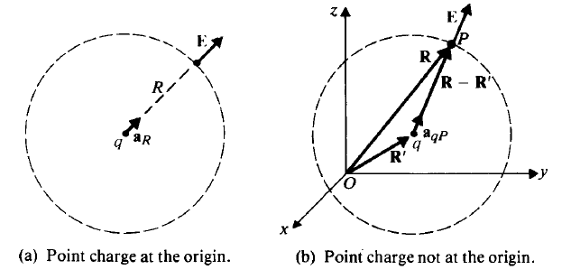

$$
\mathbf{E}_{p}=\frac{q\left(\mathbf{R}-\mathbf{R}^{\prime}\right)}{4 \pi \epsilon_{0}\left|\mathbf{R}-\mathbf{R}^{\prime}\right|^{3}} \quad(\mathrm{~V} / \mathrm{m})
$$
$\mathbf{E}=0$ everywhere inside a conducting shell.

### 2.3 Electric Field Due to System of Discrete Charges

Suppose an electrostatic field is created by a group of $n$ discrete point charges located at different positions.
$$
\mathbf{E}=\frac{1}{4 \pi \epsilon_{0}} \sum_{k=1}^{n} \frac{q_{k}\left(\mathbf{R}-\mathbf{R}_{k}^{\prime}\right)}{\left|\mathbf{R}-\mathbf{R}_{k}^{\prime}\right|^{3}} \quad(\mathrm{~V} / \mathrm{m})
$$

**Important Approximation**
$$
(1+x)^n = 1 + nx  \qquad if \quad x \to 0
$$

**Electric Dipole**

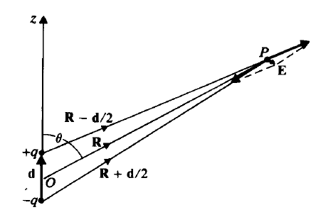

$$
\mathbf{E}=\frac{q}{4 \pi \epsilon_{0}}\left\{\frac{\mathbf{R}-\frac{\mathbf{d}}{2}}{\left|\mathbf{R}-\frac{\mathbf{d}}{2}\right|^{3}}-\frac{\mathbf{R}+\frac{\mathbf{d}}{2}}{\left|\mathbf{R}+\frac{\mathbf{d}}{2}\right|^{3}}\right\}
$$
We can suppose that $d\ll R$
$$
\begin{aligned}
\left|\mathbf{R}-\frac{\mathbf{d}}{2}\right|^{-3} &=\left[\left(\mathbf{R}-\frac{\mathbf{d}}{2}\right) \cdot\left(\mathbf{R}-\frac{\mathbf{d}}{2}\right)\right]^{-3 / 2} \\
&=\left[\boldsymbol{R}^{2}-\mathbf{R} \cdot \mathbf{d}+\frac{d^{2}}{4}\right]^{-3 / 2} \\
& \cong R^{-3}\left[1-\frac{\mathbf{R} \cdot \mathbf{d}}{R^{2}}\right]^{-3 / 2} \\
& \cong R^{-3}\left[1+\frac{3}{2} \frac{\mathbf{R} \cdot \mathbf{d}}{R^{2}}\right].
\end{aligned}
$$
Then the approximate formula for the electric field due to electric dipole is 
$$
\mathbf{E} \cong \frac{q}{4 \pi \epsilon_{0} R^{3}}\left[3 \frac{\mathbf{R} \cdot \mathbf{d}}{R^{2}} \mathbf{R}-\mathbf{d}\right].
$$
We define the product of the charge $q$ and the vector $\mathbf{d}$ (going from $-q$ to $+ q$) as the **electric dipole moment $\mathbf{p}$** :
$$
\mathbf{p} = q \mathbf{d}.
$$

$$
\begin{array}{c}
\mathbf{p}=\mathbf{a}_{z} p=p\left(\mathbf{a}_{R} \cos \theta-\mathbf{a}_{\theta} \sin \theta\right) \\
\mathbf{R} \cdot \mathbf{p}=R p \cos \theta,
\end{array}
$$

$$
\mathbf{E}=\frac{p}{4 \pi \epsilon_{0} R^{3}}\left(\mathbf{a}_{R} 2 \cos \theta+\mathbf{a}_{\theta} \sin \theta\right) \quad(\mathrm{V} / \mathrm{m})
$$

### 2.4 Electric Field Due to A Continuous Distribution of Charge

**Volume Charge**
$$
\mathbf{E}=\frac{1}{4 \pi \epsilon_{0}} \int_{V^{\prime}} \rho \frac{\mathbf{R}}{R^{3}} d v^{\prime} \quad(\mathrm{V} / \mathrm{m}) .
$$
**Surface Charge**
$$
\mathbf{E}=\frac{1}{4 \pi \epsilon_{0}} \int_{S^{\prime}} \mathbf{a}_{R} \frac{\rho_{s}}{R^{2}} d s^{\prime} \quad(\mathrm{V} / \mathrm{m})
$$
**Infinite Surface Charge**
$$
\begin{array}{l}
\mathbf{E}=\mathbf{a}_{z} E_{z}=\mathbf{a}_{z} \frac{\rho_{s}}{2 \epsilon_{0}}, \quad z>0 \\
 \mathbf{E}=-\mathbf{a}_{z} E_{z}=-\mathbf{a}_{z} \frac{\rho_{s}}{2 \epsilon_{0}}, \quad z<0
\end{array}
$$
**Line Charge**
$$
\mathbf{E}=\frac{1}{4 \pi \epsilon_{0}} \int_{L^{\prime}} \mathbf{a}_{R} \frac{\rho_{\ell}}{R^{2}} d \ell^{\prime} \quad(\mathrm{V} / \mathrm{m})
$$
**Infinite Line Charge**
$$
\mathbf{E}=\mathbf{a}_{r} \frac{\rho_{\ell}}{2 \pi \epsilon_{0} r} \quad(\mathrm{~V} / \mathrm{m})
$$

### 2.5 Electric Potential

$$
\mathbf{E}=-\nabla V
$$

$$
V_{21} = V_{2} - V_{1} = -\int_{P_{1}}^{P_{2}} \mathbf{E} \cdot d \mathbf{\ell}
$$

$$
V=\frac{q}{4 \pi \epsilon_{0} R} \quad(\mathrm{~V})
$$

**Discrete Point Charges**
$$
V=\frac{1}{4 \pi \epsilon_{0}} \sum_{k=1}^{n} \frac{q_{k}}{\left|\mathbf{R}-\mathbf{R}_{k}^{\prime}\right|}
$$
**Electric Dipole**
$$
V=\frac{\mathbf{p} \cdot \mathbf{a}_{R}}{4 \pi \epsilon_{0} R^{2}} \quad(\mathrm{~V})
$$
**Volume Charge**
$$
V=\frac{1}{4 \pi \epsilon_{0}} \int_{V^{\prime}} \frac{\rho}{R} d v^{\prime}
$$
**Surface Charge**
$$
V=\frac{1}{4 \pi \epsilon_{0}} \int_{S^{\prime}} \frac{\rho_{s}}{R} d s^{\prime} \quad(\mathrm{V})
$$
**Line Charge**
$$
V=\frac{1}{4 \pi \epsilon_{0}} \int_{L^{\prime}} \frac{\rho_{\ell}}{R} d \ell^{\prime}
$$
If symmetry conditions exist such that a Gaussian surface can be constructed over which $\mathbf{E} \cdot d \mathbf{s}$ is constant, it is always easier to determine $\mathbf{E}$ directly. If not, we can determine $\mathbf{E}$ by first finding $V$.

### 2.6 Conductors in Static Electric Field

$$
\begin{array}{|c|}
\hline \begin{array}{c}
\text { Inside a Conductor } \\
\text { (Under Static Conditions) }
\end{array} \\
\hline \rho=0 \\
\mathbf{E}=0\\
\hline
\end{array}
$$

Under static conditions the $\mathbf{E}$ field on a conductor surface is everywhere normal to the surface. In other words, the surface of a conductor is an equipotential surface under static conditions.
$$
\begin{array}{|c|}
\hline \begin{array}{c}
\text { Boundary Conditions } \\
\text { at a Conductor/Free Space Interface }
\end{array} \\
\hline E_{t}=0 \\
E_{n}=\frac{\rho_{s}}{\epsilon_{0}}\\
\hline
\end{array}
$$

### 3.7 Dielectrics in Static Electric Field

**Polarization Vector $\mathbf{P}$**
$$
\mathbf{P}=\lim _{\Delta v \rightarrow 0} \frac{\sum_{k=1}^{n \Delta v} \mathbf{p}_{k}}{\Delta v} \quad\left(\mathrm{C} / \mathrm{m}^{2}\right)
$$
**Vector Identity**
$$
\boldsymbol{\nabla}^{\prime} \cdot(f \mathbf{A})=f \mathbf{\nabla}^{\prime} \cdot \mathbf{A}+\mathbf{A} \cdot \boldsymbol{\nabla}^{\prime} f
$$
**Potential of Dielectrics**
$$
V=\frac{1}{4 \pi \epsilon_{0}} \oint_{S^{\prime}} \frac{\mathbf{P} \cdot \mathbf{a}_{n}^{\prime}}{R} d s^{\prime}+\frac{1}{4 \pi \epsilon_{0}} \int_{V^{\prime}} \frac{\left(-\mathbf{\nabla}^{\prime} \cdot \mathbf{P}\right)}{R} d v^{\prime}
$$

$$
\begin{array}{l}
\rho_{p s}=\mathbf{P} \cdot \mathbf{a}_{n} \\
\rho_{p}=-\nabla \cdot \mathbf{P}
\end{array}
$$

These are referred to as **polarization charge densities** or **bound-charge densities**. In other words, a polarized dielectric may be replaced by an equivalent polarization surface charge density $\rho_{p s}$ and an equivalent polarization volume charge density $\rho_{p}$ for field calculations:
$$
V=\frac{1}{4 \pi \epsilon_{0}} \oint_{S^{\prime}} \frac{\rho_{p s}}{R} d s^{\prime}+\frac{1}{4 \pi \epsilon_{0}} \int_{V^{\prime}} \frac{\rho_{p}}{R} d v^{\prime}
$$

### 2.8 Electric Flux Density and Dielectric Constant

**Electric Flux Density (Electric Displacement)**
$$
\mathbf{D}=\epsilon_{0} \mathbf{E}+\mathbf{P} \quad\left(\mathrm{C} / \mathrm{m}^{2}\right)
$$
The use of the vector $\mathbf{D}$ enables us to write a divergence relation between the electric field and the distribution of free charges in any medium without the necessity of dealing explicitly with the polarization vector $\mathbf{P}$ or the polarization charge density $\rho_{p}$. We obtain the new equation
$$
\nabla \cdot \mathbf{D}=\rho \quad\left(\mathrm{C} / \mathrm{m}^{3}\right)
$$

$$
\oint_{s} \mathbf{D} \cdot d \mathbf{s}=Q \quad \text { (C) }
$$

**Electric Susceptibility**
$$
\mathbf{P}=\epsilon_{0} \chi_{e} \mathbf{E}
$$
A dielectric medium is linear if $\chi_{e}$ is independent of $E$ and homogeneous if $\chi_{e}$ is independent of space coordinates.
$$
\begin{aligned}
\mathbf{D} &=\epsilon_{0}\left(1+\chi_{e}\right) \mathbf{E} \\
&=\epsilon_{0} \epsilon_{r} \mathbf{E}=\epsilon \mathbf{E} \quad\left(\mathbf{C} / \mathrm{m}^{2}\right)
\end{aligned}
$$
where
$$
\epsilon_{r}=1+\chi_{e}=\frac{\epsilon}{\epsilon_{0}}
$$
is a dimensionless quantity known as the **relative permittivity** or the **dielectric constant** of the medium. $\epsilon$ is the **absolute permittivity** of the medium and is measured in farads per meter $(\mathrm{F} / \mathrm{m})$.

**Dielectric Breakdown**

The maximum electric field intensity that a dielectric material can withstand without breakdown i the the **dielectric strength** of the material.

### 2.9 Boundary Conditions for Electrostatic Fields
$$
E_{1 t}=E_{2 t} \quad(\mathrm{~V} / \mathrm{m})
$$
This states that the tangential component of an E field is continuous across an interface. 
$$
D_{1 n}-D_{2 n}=\rho_{s} \quad\left(\mathrm{C} / \mathrm{m}^{2}\right)
$$
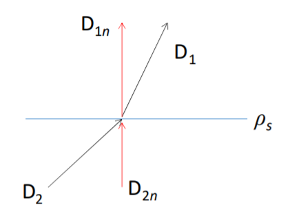

The normal component of $D$ field is discontinuous across an interface where a surface charge exists --- the amount of discontinuity being equal to the surface charge density.

### 2.10 Capacitance and Capacitors

$$
Q=C V，
$$

where the constant of proportionality $C$ is called the **capacitance** of the isolated conducting body.

**Method of Capacitance Calculation**

1. Choose an appropriate coordinate system for the given geometry.
2. Assume charges $+Q$ and $-Q$ on the conductors.
3. Find $\mathbf{E}$ from $Q$ by Eq. (3-122), Gauss's law, or other relations.
4. Find $V_{12}$ by evaluating
$$
V_{12}=-\int_{2}^{1} \mathbf{E} \cdot d \ell
$$
​		from the conductor carrying $-Q$ to the other carrying $+Q$.
5. Find $C$ by taking the ratio $Q / V_{12}$.

**Series-connected Capacitors**
$$
\frac{1}{C_{s r}}=\frac{1}{C_{1}}+\frac{1}{C_{2}}+\cdots+\frac{1}{C_{n}}
$$
**Parallel-connected Capacitors**
$$
C_{\mathrm{II}}=C_{1}+C_{2}+\cdots+C_{n}
$$
**Capacitances in Multiconductor Systems**
$$
\begin{aligned}
&V_{1}=p_{11} Q_{1}+p_{12} Q_{2}+\cdots+p_{1 N} Q_{N} \\
&V_{2}=p_{21} Q_{1}+p_{22} Q_{2}+\cdots+p_{2 N} Q_{N} \\
&\vdots \\
&V_{N}=p_{N 1} Q_{1}+p_{N 2} Q_{2}+\cdots+p_{N N} Q_{N}
\end{aligned}
$$
$p_{ij}$'s are called the **coefficients of potential**, which are constants whose values depend on the shape and position of the conductors as well as the permittivity of the surrounding medium. In an isolated system, the net electric charge should be zero.
$$
\begin{aligned}
&Q_{1}=c_{11} V_{1}+c_{12} V_{2}+\cdots+c_{1 N} V_{N} \\
&Q_{2}=c_{21} V_{1}+c_{22} V_{2}+\cdots+c_{2 N} V_{N} \\
&\vdots \\
&Q_{N}=c_{N 1} V_{1}+c_{N 2} V_{2}+\cdots+c_{N N} V_{N}
\end{aligned}
$$
$c_{ii}$'s are called the **coefficients of capacitance** (positive), which equal the rations of the charge $Q_i$ on the potential $V_i$ of the $i$th conductor with all other conductors grounded. The $c_{ij}$'s ($i \neq j$) are called the **coefficients of induction** (negative). The condition of reciprocity guarantees that $p_{ij} = p _{ji}$ and $c_{ij} = c_{ji}$.

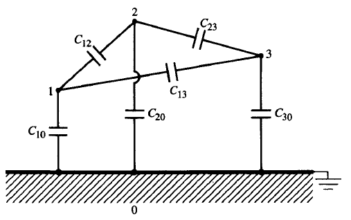

$$
\begin{aligned}
&Q_{1}=c_{11} V_{1}+c_{12} V_{2}+c_{13} V_{3} \\
&Q_{2}=c_{12} V_{1}+c_{22} V_{2}+c_{23} V_{3} \\
&Q_{3}=c_{13} V_{1}+c_{23} V_{2}+c_{33} V_{3}
\end{aligned}
$$

$$
\begin{aligned}
&Q_{1}=C_{10} V_{1}+C_{12}\left(V_{1}-V_{2}\right)+C_{13}\left(V_{1}-V_{3}\right) \\
&Q_{2}=C_{20} V_{2}+C_{12}\left(V_{2}-V_{1}\right)+C_{23}\left(V_{2}-V_{3}\right) \\
&Q_{3}=C_{30} V_{3}+C_{13}\left(V_{3}-V_{1}\right)+C_{23}\left(V_{3}-V_{2}\right)
\end{aligned}
$$

Then we obtain
$$
\begin{aligned}
c_{11}=& C_{10}+C_{12}+C_{13} \\
c_{22}=& C_{20}+C_{12}+C_{23} \\
c_{33}=& C_{30}+C_{13}+C_{23} 
\end{aligned}
$$
$$
\begin{aligned}
c_{12}=-C_{12} \\
c_{23}=-C_{23} \\
c_{13}=-C_{13}
\end{aligned}
$$

**Electrostatic Shielding**

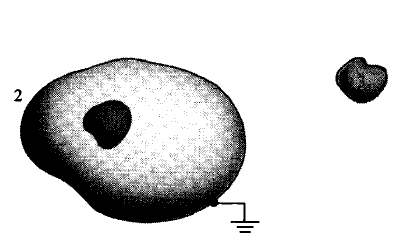

The conducting shell 2 completely encloses conducting body 1. The change of $V_3$ will not affect $Q_1$

### 2.11 Electrostatic Energy and Forces

The potential energy of a group of $N$ discrete point charges at rest is 
$$
W_{e}=\frac{1}{2} \sum_{k=1}^{N} Q_{k} V_{k} \quad(J)
$$

$$
V_{k}=\frac{1}{4 \pi \epsilon_{0}} \sum_{j=1 \atop(j \neq k)}^{N} \frac{Q_{j}}{R_{j k}}
$$

$W_{e}$ represents only the interaction energy (mutual energy) and does not include the work required to assemble the individual point charges themselves (self-energy).

**Continuous Charge Distribution**
$$
\begin{aligned}
&W_{e}=\frac{1}{2} \int_{V^{\prime}} \rho V d v
&(\mathbf{J})
\end{aligned}
$$
$W_{e}$ includes the work (self-energy) required to assemble the distribution of macroscopic charges, because it is the energy of interaction of every infinitesimal charge element with all other infinitesimal charge elements.
$$
W_{e}=\frac{1}{2} \int_{V^{\prime}} \mathbf{D} \cdot \mathbf{E} d v \quad(\mathbf{J})
$$

$$
\begin{aligned}
&W_{e}=\frac{1}{2} \int_{V^{\prime}} \epsilon E^{2} d v \\
&W_{e}=\frac{1}{2} \int_{V^{\prime}} \frac{D^{2}}{\epsilon} d v \quad(J)
\end{aligned}
$$

**Electrostatic Energy Density**
$$
\begin{aligned}
&w_{e}=\frac{1}{2} \mathbf{D} \cdot \mathbf{E} \quad\left(\mathrm{J} / \mathrm{m}^{3}\right) \\
&w_{e}=\frac{1}{2} \epsilon E^{2} \quad\left(\mathrm{~J} / \mathrm{m}^{3}\right) \\
&w_{e}=\frac{D^{2}}{2 \epsilon} \quad\left(\mathrm{J} / \mathrm{m}^{3}\right)
\end{aligned}
$$
**Two-conductor Capacitor**
$$
W_{e}=\frac{1}{2} C V^{2} \quad(\mathrm{~J})
$$

$$
W_{e}=\frac{1}{2} Q V\quad(\mathrm{~J})
$$

$$
W_{e}=\frac{Q^{2}}{2 C} \quad(\mathrm{~J})
$$

**Isolated System of Bodies with Fixed Charges**
$$
\mathbf{F}_{Q}=-\nabla W_{e} \quad(\mathrm{~N})
$$
If the body under consideration is constrained to rotate about an axis, say the z-axis, then
$$
\left(T_{Q}\right)_{z}=-\frac{\partial W_{e}}{\partial \phi} \quad(\mathrm{N} \cdot \mathrm{m})
$$
**System of Conducting Bodies with Fixed Potentials**
$$
\mathbf{F}_{V}=\nabla W_{e}
(\mathbf{N}) \text { . }
$$

$$
\left(T_{V}\right)_{z}=\frac{\partial W_{e}}{\partial \phi} \quad(\mathrm{N} \cdot \mathrm{m})
$$

## 3. Solution of Electrostatic Problems

### 3.1 Poisson's and Laplace's Equation

**Poisson's Equation**
$$
\nabla^{2} V=-\frac{\rho}{\epsilon}
$$

$$
\frac{\partial^{2} V}{\partial x^{2}}+\frac{\partial^{2} V}{\partial y^{2}}+\frac{\partial^{2} V}{\partial z^{2}}=-\frac{\rho}{\epsilon} \quad\left(\mathrm{V} / \mathrm{m}^{2}\right)
$$

Cylindrical coordinates:
$$
\nabla^{2} V=\frac{1}{r} \frac{\partial}{\partial r}\left(r \frac{\partial V}{\partial r}\right)+\frac{1}{r^{2}} \frac{\partial^{2} V}{\partial \phi^{2}}+\frac{\partial^{2} V}{\partial z^{2}}
$$
Spherical coordinates:
$$
\nabla^{2} V=\frac{1}{R^{2}} \frac{\partial}{\partial R}\left(R^{2} \frac{\partial V}{\partial R}\right)+\frac{1}{R^{2} \sin \theta} \frac{\partial}{\partial \theta}\left(\sin \theta \frac{\partial V}{\partial \theta}\right)+\frac{1}{R^{2} \sin ^{2} \theta} \frac{\partial^{2} V}{\partial \phi^{2}}
$$
**Laplace's  Equation**
$$
\nabla^{2} V=0
$$
**Uniqueness of Electrostatic Solutions**

A solution of Poisson's equation that satisfies the given boundary conditions is a unique solution.

### 3.2 Method of Images

The method of replacing bounding surfaces by appropriate image charges in lieu of a  formal solution of Poisson's or Laplace's equation is called the **method of images**.

**Point Charge and Conducting Plane**

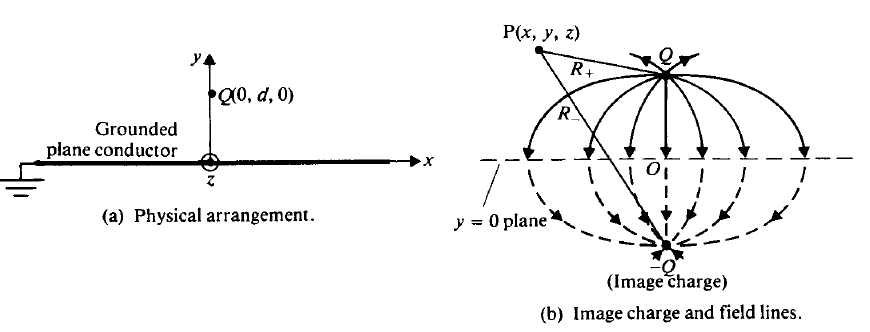

**Line Charge and Parallel Conducting Cylinder**

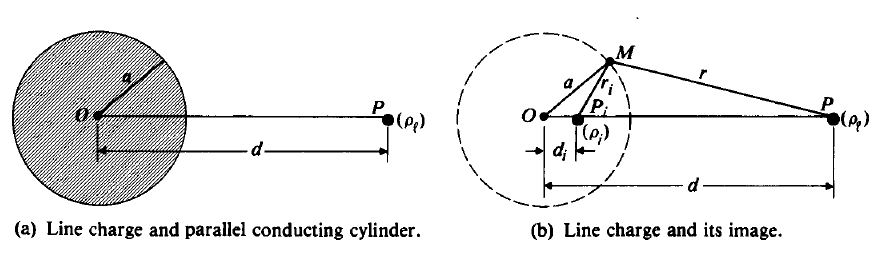

$$
d_{i}=\frac{a^{2}}{d}
$$

$$
\rho_i = - \rho_l
$$

**Point Charge and Conducting Sphere**

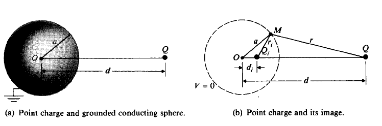

$$
\begin{aligned}
&Q_{i}=-\frac{a}{d} Q \\
& d_{i}=\frac{a^{2}}{d} .
\end{aligned}
$$
The total induced charge on the surface of the sphere is exactly equal to the image charge $Q_i$.

If the conducting sphere is electrically neutral and is not grounded, an additional point charge 
$$
Q^{\prime}=-Q_{i}=\frac{a}{d} Q
$$
would be needed at the center to make the sphere neutral.

**Charged Sphere and Grounded Plane**

$$
\alpha=\frac{a}{2 c}
$$

$$
C=\frac{Q}{V_{0}}=4 \pi \epsilon_{0} a\left(1+\alpha+\frac{\alpha^{2}}{1-\alpha^{2}}+\cdots\right)
$$

### 3.3 Boundary-Value Problems in Cartesian Coordinates

$$
\frac{\partial^{2} V}{\partial x^{2}}+\frac{\partial^{2} V}{\partial y^{2}}+\frac{\partial^{2} V}{\partial z^{2}}=0
$$

$$
V(x, y, z)=X(x) Y(y) Z(z)
$$

$$
\frac{1}{X(x)} \frac{d^{2} X(x)}{d x^{2}}+\frac{1}{Y(y)} \frac{d^{2} Y(y)}{d y^{2}}+\frac{1}{Z(z)} \frac{d^{2} Z(z)}{d z^{2}}=0
$$

$$
\frac{1}{X(x)} \frac{d^{2} X(x)}{d x^{2}}=-k_{x}^{2}
$$
$$
\begin{aligned}
&\text { Possible Solutions of } X^{\prime \prime}(x)+k_{x}^{2} X(x)=0\\
&\begin{array}{|cccc|}
\hline \boldsymbol{k}_{x}^{2} & k_{x} & {X(x)} & \text { Exponential forms }^{\dagger} \text { of } X(x) \\
\hline 0 & 0 & A_{0} x+B_{0} & \\
+ & k & A_{1} \sin k x+B_{1} \cos k x & C_{1} e^{j k x}+D_{1} e^{-j k x} \\
- & j k & A_{2} \sinh k x+B_{2} \cosh k x & C_{2} e^{k x}+D_{2} e^{-k x} \\
\hline
\end{array}
\end{aligned}
$$

 The exponential forms of $X(x)$ are related to the trigonometric and hyperbolic forms listed in the third column by the following formulas:
$e^{\pm j x x}=\cos k x \pm j \sin k x, \quad \cos k x=\frac{1}{2}\left(e^{j k x}+e^{-j k x}\right), \quad \sin k x=\frac{1}{2 j}\left(e^{j x x}-e^{-j k x}\right)$
$e^{\pm k x}=\cosh k x \pm \sinh k x, \quad \cosh k x=\frac{1}{2}\left(e^{k x}+e^{-k x}\right), \quad \sinh k x=\frac{1}{2}\left(e^{k x}-e^{-k x}\right)$

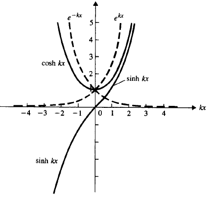

$$
\begin{aligned}
V(0, y) &=\sum_{n=1}^{\infty} V_{n}(0, y)=\sum_{n=1}^{\infty} C_{n} \sin \frac{n \pi}{b} y \\
&=V_{0}, \quad 0<y<b
\end{aligned}
$$

$$
C_{n}=\left\{\begin{array}{ll}
\frac{4 V_{0}}{n \pi} & \text { if } n \text { is odd } \\
0 & \text { if } n \text { is even }
\end{array}\right.
$$

### 3.4 Boundary-Value Problems in Cylindrical Coordinates

$$
\frac{1}{r} \frac{\partial}{\partial r}\left(r \frac{\partial V}{\partial r}\right)+\frac{1}{r^{2}} \frac{\partial^{2} V}{\partial \phi^{2}}+\frac{\partial^{2} V}{\partial z^{2}}=0
$$

$$
V(r, \phi)=R(r) \Phi(\phi)
$$

$$
\frac{r}{R(r)} \frac{d}{d r}\left[r \frac{d R(r)}{d r}\right]+\frac{1}{\Phi(\phi)} \frac{d^{2} \Phi(\phi)}{d \phi^{2}}=0
$$

If $k = n > 0$,
$$
\Phi(\phi)=A_{\phi} \sin n \phi+B_{\phi} \cos n \phi
$$

$$
R(r)=A_{r} r^{n}+B_{r} r^{-n}
$$

If $k = 0$,
$$
\Phi(\phi)=B_{0}
$$

$$
R(r)=C_{0} \ln r+D_{0}
$$

### 3.5 Boundary-Value Problems in Spherical Coordinates

$$
\frac{1}{R^{2}} \frac{\partial}{\partial R}\left(R^{2} \frac{\partial V}{\partial R}\right)+\frac{1}{R^{2} \sin \theta} \frac{\partial}{\partial \theta}\left(\sin \theta \frac{\partial V}{\partial \theta}\right)=0
$$

$$
V(R, \theta)=\Gamma(R) \Theta(\theta)
$$

$$
\frac{1}{\Gamma(R)} \frac{d}{d R}\left[R^{2} \frac{d \Gamma(R)}{d R}\right]=k^{2} \\
\frac{1}{\Theta(\theta) \sin \theta} \frac{d}{d \theta}\left[\sin \theta \frac{d \Theta(\theta)}{d \theta}\right]=-k^{2}
$$

$$
\Gamma_{n}(R)=A_{n} R^{n}+B_{n} R^{-(n+1)}
$$

$$
n(n+1)=k^{2}
$$

$$
\Theta_{n}(\theta)=P_{n}(\cos \theta)
$$

$$
\begin{array}{|lc|}
\hline n & P_{n}(\cos \theta) \\
\hline 0 & 1 \\
1 & \cos \theta \\
2 & \frac{1}{2}\left(3 \cos ^{2} \theta-1\right) \\
3 & \frac{1}{2}\left(5 \cos ^{3} \theta-3 \cos \theta\right) \\
\hline
\end{array}
$$

## 4 Steady Electric Current

### 4.1 Current Density and Ohm's Law

$$
\Delta Q=N q \mathbf{u} \cdot \mathbf{a}_{n} \Delta s \Delta t
\text { (C). }
$$

$$
\Delta I=\frac{\Delta Q}{\Delta t}=N q \mathbf{u} \cdot \mathbf{a}_{n} \Delta s=N q \mathbf{u} \cdot \Delta \mathbf{s}
$$

**Current Density**
$$
\mathbf{J}=N q \mathbf{u} \quad\left(\mathrm{A} / \mathrm{m}^{2}\right)
$$

$$
I=\int_{S} \mathbf{J} \cdot d \mathbf{s}
\text { (A). }
$$

$$
\mathbf{J}=\rho \mathbf{u}  \left(\mathrm{A} / \mathrm{m}^{2}\right)
$$

**Electron Mobility**
$$
\mathbf{u}=-\mu_{e} \mathbf{E} \quad(\mathrm{m} / \mathrm{s})
$$

$$
\mathbf{J}=\sigma \mathbf{E} \quad\left(\mathrm{A} / \mathrm{m}^{2}\right)
$$
where the proportionality constant, $\sigma=-\rho_{e} \mu_{e}$, is a macroscopic constitutive parameter of the medium called **conductivity**.
$$
R=\frac{\ell}{\sigma S}
$$

### 4.2 Electromotive Force and Kirchhoff's Voltage Law

For an ohmic material $\mathbf{J}=\sigma \mathbf{E}$, 
$$
\oint_{c} \frac{1}{\sigma} \mathbf{J} \cdot d \ell=0,
$$
which tells us that a steady current cannot be maintained in the same direction in a closed circuit by an electrostatic field. 

$$
\mathscr{V}=\int_{2}^{1} \mathbf{E}_{i} \cdot d \ell=-\int_{2}^{1} \mathbf{E} \cdot d \ell
$$
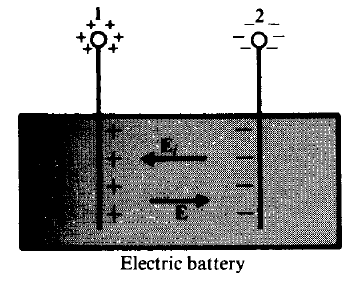

$E_i$ is called **impressed electric field intensity**.

**Kirchhoff's voltage law**
$$
\sum_{j} \mathscr{r}_{j}=\sum_{k} \boldsymbol{R}_{\boldsymbol{k}} I_{k}
$$
**Kirchhoff's Current Law**
$$
\mathbf{\nabla} \cdot \mathbf{J}=-\frac{\partial \rho}{\partial t} \quad\left(\mathbf{A} / \mathrm{m}^{3}\right)
$$

$$
\sum_{j} I_{j}=0
$$

**Time for a conductor to reach an equilibrium**
$$
\rho=\rho_{0} e^{-(\sigma / \epsilon) t} \quad\left(\mathrm{C} / \mathrm{m}^{3}\right)
$$

$$
\tau=\frac{\epsilon}{\sigma}\\
\text { The time constant } \tau \text { is called the relaxation time. }
$$

**Joule's Law**
$$
P=\int_{V} \mathbf{E} \cdot \mathbf{J} d v \quad(\mathbf{W})
$$

$$
P=I^{2} R \quad(\mathrm{~W})
$$

### 4.3 Boundary Conditions for Current Density

$$
\begin{array}{|cc|}
\hline {\text { Governing Equations for Steady Current Density }} \\
\hline \text { Differential Form } & \text { Integral Form } \\
\hline \mathbf{\nabla} \cdot \mathbf{J}=0 & \oint_{S} \mathbf{J} \cdot d \mathbf{s}=0 \\
\mathbf{\nabla} \times\left(\frac{\mathbf{J}}{\sigma}\right)=0 & \oint_{\mathbf{C}} \frac{1}{\sigma} \mathbf{J} \cdot d \ell=0 \\
\hline
\end{array}
$$

$$
\begin{array}{|c|c|}
\hline \epsilon_{1} \text { and } \epsilon_{2} & \sigma_{1} \text { and } \sigma_{2} \\
\hline E_{2 t}=E_{1 t} & J_{1 t} / \sigma_{1}=J_{2 t} / \sigma_{2} \\
D_{1 n}-D_{2 n}=\rho_{s} \rightarrow \epsilon_{1} E_{1 n}-\epsilon_{2} E_{2 n}=\rho_{s}, & J_{1 n}=J_{2 n} \rightarrow \sigma_{1} E_{1 n}=\sigma_{2} E_{2 n} \\
\hline
\end{array}
$$

### 4.4 Resistance Calculations

$$
C=\frac{Q}{V}=\frac{\oint_{S} \mathbf{D} \cdot d \mathbf{s}}{-\int_{L} \mathbf{E} \cdot d \ell}=\frac{\oint_{S} \epsilon \mathbf{E} \cdot d \mathbf{s}}{-\int_{L} \mathbf{E} \cdot d \ell}
$$

$$
R=\frac{V}{I}=\frac{-\int_{L} \mathbf{E} \cdot d \ell}{\oint_{S} \mathbf{J} \cdot d \mathbf{s}}=\frac{-\int_{L} \mathbf{E} \cdot d \ell}{\oint_{S} \sigma \mathbf{E} \cdot d \mathbf{s}}
$$

$$
R C=\frac{C}{G}=\frac{\epsilon}{\sigma}
$$

## 5 Static Magnetic Fields

$$
\mathbf{F}_{m}=q \mathbf{u} \times \mathbf{B}, \quad(\mathbf{N})
$$

where $\mathbf{u}(\mathrm{m} / \mathrm{s})$ is the velocity vector, and $\mathbf{B}$ is measured in webers per square meter $\left(\mathrm{Wb} / \mathrm{m}^{2}\right)$ or teslas  $(\mathrm{T}) .$The total electromagnetic force on a charge $q$ is, then, $\mathbf{F}=\mathbf{F}_{e}+\mathbf{F}_{m} ;$ that is,
$$
\mathbf{F}=q(\mathbf{E}+\mathbf{u} \times \mathbf{B}), \quad(\mathbf{N})
$$
which is called **Lorentz's force equation**.

### 5.1 Fundamental Postulates of Magnetostatics in Free Space

$$
\begin{array}{|cc|}
\hline  {\begin{array}{c}
\text { Postulates of Magnetostatics in } 
\text { Free Space }
\end{array}} \\
\hline \text { Differential Form } & \text { Integral Form } \\
\hline \mathbf{\nabla} \cdot \mathbf{B}=0 & \oint_{S} \mathbf{B} \cdot d \mathbf{s}=0 \\
\nabla \times \mathbf{B}=\mu_{0} \mathbf{J} & \oint_{C} \mathbf{B} \cdot d \ell=\mu_{0} I \\
\hline
\end{array}
$$

There are no magnetic flow sources, and the magnetic flux lines always close upon themselves. The law of conservation of magnetic flux and Ampere's circuital law.

### 5.2 Vector Magnetic Potential

$$
\mathbf{B}=\mathbf{\nabla} \times \mathbf{A} \quad(\mathrm{T})
$$
The vector field $A$ so defined is called the **vector magnetic potential**.

**Coulomb Condition**
$$
\nabla \cdot \mathbf{A}=0, \\
 \nabla^{2} \mathbf{A}=-\mu_{0} \mathbf{J}
$$
This is a **vector Poisson's equation**

In Cartesian coordinates, 
$$
\begin{aligned}
&\nabla^{2} A_{x}=-\mu_{0} J_{x} \\
&\nabla^{2} A_{y}=-\mu_{0} J_{y} \\
&\nabla^{2} A_{z}=-\mu_{0} J_{z}
\end{aligned}
$$
The solution is
$$
\mathbf{A}=\frac{\mu_{0}}{4 \pi} \int_{V^{\prime}} \frac{\mathbf{J}}{R} d v^{\prime} \quad(\mathrm{Wb} / \mathrm{m})
$$
Vector magnetic potential's line integral around any closed path equals the total magnetic flux passing through the area enclosed by the path.
$$
\Phi=\int_{S}(\nabla \times \mathbf{A}) \cdot d \mathbf{s}=\oint_{C} \mathbf{A} \cdot d \ell
$$

### 5.3 The Biot-Savart Law and Applications

$$
\mathbf{A}=\frac{\mu_{0} I}{4 \pi} \oint_{C^{\prime}} \frac{d \ell^{\prime}}{R}
$$

**Biot-Savart Law**
$$
\mathbf{B}=\frac{\mu_{0} I}{4 \pi} \oint_{C^{\prime}} \frac{d \ell^{\prime} \times \mathbf{a}_{R}}{R^{2}}
$$
**Infinitely Long Straight wire**
$$
\mathbf{B}_{\phi}=\mathbf{a}_{\phi} \frac{\mu_{0} I}{2 \pi r}
$$

### 5.4 The Magnetic Dipole

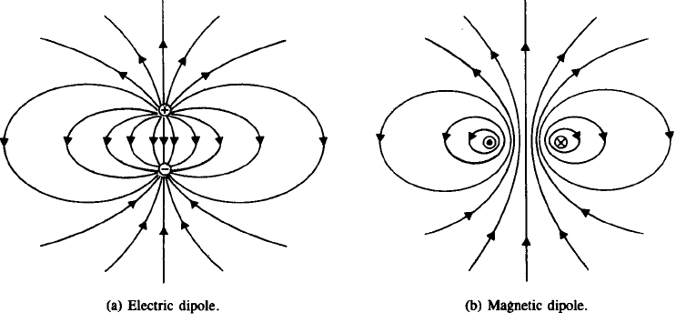

$$
\mathbf{A}=\mathbf{a}_{\phi} \frac{\mu_{0}\left(I \pi b^{2}\right)}{4 \pi R^{2}} \sin \theta
$$

$$
\mathbf{A}=\frac{\mu_{0} \mathbf{m} \times \mathbf{a}_{R}}{4 \pi R^{2}} \quad(\mathrm{~Wb} / \mathrm{m})
$$
where $\mathbf{m}=\mathbf{a}_{z} I \pi b^{2}=\mathbf{a}_{z} I S=\mathbf{a}_{z} m \quad\left(\mathrm{~A} \cdot \mathrm{m}^{2}\right)$ is defined as the **magnetic dipole moment**
$$
\mathbf{B}=\frac{\mu_{0} m}{4 \pi R^{3}}\left(\mathbf{a}_{R} 2 \cos \theta+\mathbf{a}_{\theta} \sin \theta\right) \quad(\mathrm{T})
$$
The same expressions are obtained when the loop has a rectangular shape, with $m=IS$.

### 5.5 Magnetization and Equivalent Current Densities

**Magnetization vector**
$$
\mathbf{M}=\lim _{\Delta v \rightarrow 0} \frac{\sum_{k=1}^{n \Delta v} \mathbf{m}_{k}}{\Delta v} \quad(\mathrm{~A} / \mathrm{m})
$$
It is the volume density of magnetic dipole moment.
$$
\mathbf{A}=\frac{\mu_{0}}{4 \pi} \int_{V^{\prime}} \frac{\mathbf{\nabla}^{\prime} \times \mathbf{M}}{R} d v^{\prime}+\frac{\mu_{0}}{4 \pi} \oint_{S^{\prime}} \frac{\mathbf{M} \times \mathbf{a}_{n}^{\prime}}{R} d s^{\prime}
$$
The effect of the magnetization vector is equivalent to both a volume current density and a surface current density.
$$
\begin{aligned}
&\mathbf{J}_{m}=\nabla \times \mathbf{M} \quad\left(\mathrm{A} / \mathrm{m}^{2}\right)\\
&\mathbf{J}_{m s}=\mathbf{M} \times \mathbf{a}_{n} \quad(\mathrm{~A} / \mathrm{m})
\end{aligned}
$$
**Equivalent Magnetization Charge Density**
$$
V_{m}=\frac{1}{4 \pi} \oint_{S^{\prime}} \frac{\mathbf{M} \cdot \mathbf{a}_{n}^{\prime}}{R} d s^{\prime}+\frac{1}{4 \pi} \int_{V^{\prime}} \frac{-\left(\mathbf{\nabla}^{\prime} \cdot \mathbf{M}\right)}{R} d v^{\prime}
$$

$$
\rho_{m s}=\mathbf{M} \cdot \mathbf{a}_{n} \quad(\mathbf{A} / \mathrm{m}) \\
\rho_{m}=-\nabla \cdot \mathbf{M} \quad\left(\mathrm{A} / \mathrm{m}^{2}\right)
$$

### 5.6 Magnetic Field Intensity and Relative Permeability

**Magnetic Field Intensity**
$$
\mathbf{H}=\frac{\mathbf{B}}{\mu_{0}}-\mathbf{M} \quad(\mathbf{A} / \mathbf{m})
$$

$$
\mathbf{\nabla} \times \mathbf{H}=\mathbf{J} \quad\left(\mathbf{A} / \mathbf{m}^{2}\right)
$$

According to Stokes's theorem
$$
\oint_{C} \mathbf{H} \cdot d \ell=I \quad \text { (A) }
$$
It is another form of **Ampère's circuital law: It states that the circulation of the magnetic field intensity around any closed path is equal to the free current flowing through the surface bounded by the path**. 

When the magnetic properties of the medium are linear and isotropic, the magnetization is directly proportional to the magnetic field intensity:
$$
\mathbf{M}=\chi_{m} \mathbf{H}
$$
where $\chi_{m}$ is a dimensionless quantity called **magnetic susceptibility**.
$$
\begin{array}{rlr}
\mathbf{B} & =\mu_{0}\left(1+\chi_{m}\right) \mathbf{H} & \\
& =\mu_{0} \mu_{r} \mathbf{H}=\mu \mathbf{H} & \left(\mathbf{W b} / \mathbf{m}^{2}\right)
\end{array}
$$
or
$$
\mathbf{H}=\frac{1}{\mu} \mathbf{B} \quad(\mathrm{A} / \mathrm{m})
$$
where
$$
\mu_{r}=1+\chi_{m}=\frac{\mu}{\mu_{0}}
$$
is another dimensionless quantity known as the **relative permeability** of the medium. The parameter $\mu=\mu_{0} \mu_{r}$ is the **absolute permeability** (or sometimes just permeability) of the medium and is measured in $\mathrm{H} / \mathrm{m} ; \chi_{m}$, and therefore $\mu_{r}$, can be a function of space coordinates. For a simple medium - linear, isotropic, and homogeneous $-\chi_{m}$ and $\mu_{r}$ are constants.
$$
\begin{array}{|cc|}
\hline \text { Electrostatics } & \text { Magnetostatics } \\
\hline \mathbf{E} & \mathbf{B} \\
\mathbf{D} & \mathbf{H} \\
\epsilon & \frac{1}{\mu} \\
\mathbf{P} & -\mathbf{M} \\
\rho & \mathbf{J} \\
V & \mathbf{A} \\
\cdot & \times \\
\times & \cdot \\
\hline
\end{array}
$$

### 5.7 Magnetic Circuits

**Magnetomotive Force**
$$
\oint_{C} \mathbf{H} \cdot d \ell=N I=\mathscr{V}_{m}
$$

$$
\Phi \cong B S
$$

$$
\Phi=\frac{\mathscr{V}_{m}}{\mathscr{R}_{f}+\mathscr{R}_{g}}
$$

$$
\mathscr{R}_{g}=\frac{\ell_{g}}{\mu_{0} S}
$$

$$
\mathscr{R}_{f}=\frac{2 \pi r_{o}-\ell_{g}}{\mu S}=\frac{\ell_{f}}{\mu S}
$$

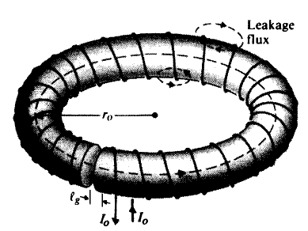

**Analogy**
$$
\begin{array}{|ll|}
\hline \text { Magnetic Circuits } & \text { Electric Circuits } \\
\hline \text { mmf, } \mathscr{V}_{m}(=N I) & \text { emf, } \mathscr{V} \\
\text { magnetic flux, } \Phi & \text { electric current, } I \\
\text { reluctance, } \mathscr{R} & \text { resistance, } R \\
\text { permeability, } \mu & \text { conductivity, } \sigma \\
\hline
\end{array}
$$

$$
\sum_{j} N_{j} I_{j}=\sum_{k} \mathscr{R}_{k} \Phi_{k}
$$
It states that **around a closed path in a magnetic circuit the algebraic sum of ampere-turns is equal to the algebraic sum of the products of the reluctances and fluxes.**
$$
\sum_{j} \Phi_{j}=0
$$
The **algebraic sums of all the magnetic fluxes flowing out of a junction in a magnetic circuit is zero.**

### 5.8 Behavior of Magnetic Materials

Diamagnetic, if $\mu_{r} \lesssim 1\left(\chi_{m}\right.$ is a very small negative number). 

Paramagnetic, if $\mu_{r} \gtrsim 1\left(\chi_{m}\right.$ is a very small positive number).

 Ferromagnetic, if $\mu_{r} \gg 1\left(\chi_{m}\right.$ is a large positive number).

**Diamagnetic**

1. No net magnetic dipole moments without external magnetic field.
2. With external magnetic field, there is a net magnetic dipole moment reducing $\mathbf{B}$
3. No permanent magnetism

**Paramagnetic**

1. There is net magnetic dipole moment without external magnetic field.
2. A very weak induced magnetization with external magnetic field.

**Ferromagnetic**

1. Magnetization can be many orders of magnitude larger than that of paramagnetic substances
2. No net magnetization without external magnetic field due to random orientation in the various domains.
3. The domains aligned with applied magnetic field with external magnetic field.

**Hysteresis**

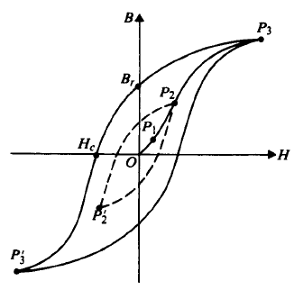

The area of the hysteresis loop corresponds to energy loss (**hysteresis loss**) per unit volume per cycle.

Hard materials have fat hysteresis loops while soft materials have tall narrow hysteresis loops/

**Curie Temperature**

Above the curie temperature, a ferromagnetic material loses magnetization, reducing to paramagnetic substances.

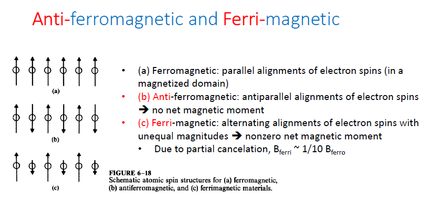

### 5.9 Boundary Conditions for Magnetostatic Fields

$$
\boldsymbol{B}_{1 n}=\boldsymbol{B}_{2 n}
$$

$$
\mathbf{a}_{n 2} \times\left(\mathbf{H}_{1}-\mathbf{H}_{2}\right)=\mathbf{J}_{s} \quad(\mathbf{A} / \mathbf{m})
$$
where $\mathbf{a}_{n 2}$  is the outward unit normal from medium 2  at the interface. 

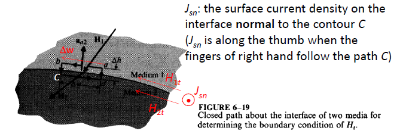

$$
H_{1 t}-H_{2 t}=J_{s n} \quad(\mathrm{~A} / \mathrm{m})
$$
**The tangential component of H is continuous across the boundary of almost all physical media; it is discontinuous only when an interface with an ideal perfect conductor or a superconductor is assumed.**

### 5.10 Inductances and Inductors

$$
\Phi_{12}=L_{12} I_{1},
$$
where the proportionality constant $L_{12}$ is called the **mutual inductance** between loops $C_{1}$ and $C_{2}$, with SI unit henry (H). In case $C_{2}$ has $N_{2}$ turns, the **flux linkage** $\Lambda_{12}$ due to $\Phi_{12}$ is
$$
\Lambda_{12}=N_{2} \Phi_{12}
$$
So the mutual inductance generalizes to:
$$
L_{12}=\frac{\Lambda_{12}}{I_{1}} \quad(\mathrm{H})
$$
The **mutual inductance between two circuits** is then the magnetic flux linkage with one circuit per unit current in the other.

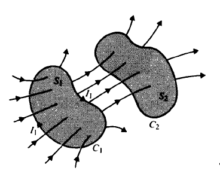

$$
L_{12}=\frac{d \Lambda_{12}}{d I_{1}} \quad(\mathrm{H})
$$
Some of the magnetic flux produced by $I_{1}$ links only with $C_{1}$ itself, and not with $C_{2}$. The total flux linkage with $C_{1}$ caused by $I_{1}$ is
$$
\Lambda_{11}=N_{1} \Phi_{11}>N_{1} \Phi_{12}
$$
The self-inductance of loop $C_{1}$ is defined as the magnetic flux linkage per unit current in the loop itself, that is,
$$
L_{11}=\frac{\Lambda_{11}}{I_{1}} \quad(\mathrm{H})
$$
for a linear medium. In general,
$$
L_{11}=\frac{d \Lambda_{11}}{d I_{1}} \quad(\mathrm{H})
$$
The self-inductance of a loop or circuit depends on the geometrical shape and the physical arrangement of the conductor constituting the loop or circuit, as well as on the permeability of the medium. With a linear medium, self-inductance does not depend on the current in the loop or circuit. As a matter of fact, it exists regardless of whether the loop or circuit is open or closed, or whether it is near another loop or circuit. 

**Neumann formula**
$$
L_{12}=\frac{\mu_{0}}{4 \pi} \oint_{C_{1}} \oint_{C_{2}} \frac{d \ell_{1} \cdot d \ell_{2}}{R} \quad(\mathrm{H})
$$
where $N_{1}$ and $N_{2}$ have been absorbed in the contour integrals over the circuits $C_{1}$ and $C_{2}$ from one end to the other. It is a general formula requiring the evaluation of a double line integral.

### 5.11 Magnetic Energy

$$
W_{m}=\frac{1}{2} \sum_{j=1}^{N} \sum_{k=1}^{N} L_{j k} I_{j} I_{k}
$$

For the current flowing in a single inductor
$$
W_{m}=\frac{1}{2} L I^{2} \quad(\mathrm{~J})
$$

$$
W_{m}=\frac{1}{2} \sum_{k=1}^{N} I_{k} \Phi_{k} \quad(J)
$$

$$
W_{m}=\frac{1}{2} \int_{V^{\prime}} \mathbf{A} \cdot \mathbf{J} d v^{\prime} \quad(\mathrm{J})
$$

$$
W_{m}=\frac{1}{2} \int_{V}, \mathbf{H} \cdot \mathbf{B} d v^{\prime} \quad(\mathrm{J})
$$

$$
W_{m}=\frac{1}{2} \int_{V^{\prime}} \frac{B^{2}}{\mu} d v^{\prime} \quad(J)
$$

$$
W_{m}=\frac{1}{2} \int_{V^{\prime}} \mu H^{2} d v^{\prime} \text { (J). }
$$

$$
L=\frac{2 W_{m}}{I^{2}} \quad(\mathrm{H})
$$

### 5.12 Magnetic Forces and Torques

$$
d \mathbf{F}_{m}=I d \ell \times \mathbf{B} \quad(\mathrm{N})
$$

$$
\mathbf{F}_{m}=I \oint_{C} d \ell \times \mathbf{B} \quad(\mathbf{N})
$$

**Ampere's Law of Force **
$$
\mathbf{F}_{21}=\frac{\mu_{0}}{4 \pi} I_{1} I_{2} \oint_{c_{1}} \oint_{C_{2}} \frac{d \ell_{1} \times\left(d \ell_{2} \times \mathbf{a}_{R_{21}}\right)}{R_{21}^{2}}(\mathbf{N})
$$
The magnetic dipole moment of a  circular circuits:
$$
\mathbf{m}=\mathbf{a}_{n} I\left(\pi b^{2}\right)=\mathbf{a}_{n} I S
$$

where $\mathbf{a}_{n}$ is a unit vector in the direction of the right thumb (normal to the plane of the loop) as the fingers of the right hand follow the direction of the current, we can write

$$
\mathbf{T}=\mathbf{m} \times \mathbf{B} \quad(\mathbf{N} \cdot \mathrm{m})
$$
**System of Circuits with Constant Flux Linkage**
$$
\mathbf{F}_{\Phi}=-\nabla W_{m} \quad(\mathbf{N}) .
$$

$$
\left(T_{\Phi}\right)_{z}=-\frac{\partial W_{m}}{\partial \phi} \quad(\mathrm{N} \cdot \mathrm{m})
$$

**System of Circuits with Constant Currents**

$$
\mathbf{F}_{I}=\nabla W_{m} \quad(\mathbf{N})
$$

$$
\left(T_{I}\right)_{z}=\frac{\partial W_{m}}{\partial \phi} \quad(\mathrm{N} \cdot \mathrm{m})
$$

$$
\mathbf{F}_{I}=I_{1} I_{2}\left(\nabla L_{12}\right) \quad(\mathrm{N})
$$

$$
\left(T_{I}\right)_{z}=I_{1} I_{2} \frac{\partial L_{12}}{\partial \phi} \quad(\mathrm{N} \cdot \mathrm{m})
$$

## 6 Time-Varying Fields and Maxwell's Equations

$$
\begin{aligned}
&\text { Fundamental Relations for Electrostatic and Magnetostatic Models }\\
&\begin{array}{|c|c|c|}
\hline  {\begin{array}{c}
\text { Fundamental } \\
\text { Relations }
\end{array}} & \begin{array}{c}
\text { Electrostatic } \\
\text { Model }
\end{array} & \begin{array}{c}
\text { Magnetostatic } \\
\text { Model }
\end{array} \\
\hline \text { Governing equations } & \begin{array}{r}
\nabla \times \mathbf{E}=0 \\
\nabla \cdot \mathbf{D}=\rho
\end{array} & \begin{array}{r}
\nabla \cdot \mathbf{B}=0 \\
\nabla \times \mathbf{H}=\mathbf{J}
\end{array} \\
\hline \begin{array}{l}
\text { Constitutive relations } \\
\text { (linear and isotropic media) }
\end{array} & \mathbf{D}=\epsilon \mathbf{E} & \mathbf{H}=\frac{1}{\mu} \mathbf{B} \\
\hline
\end{array}
\end{aligned}
$$

### 6.1 Faraday's Law of Electromagnetic Induction

**Fundamental Postulate for Electromagnetic Induction**
$$
\nabla \times \mathbf{E}=-\frac{\partial \mathbf{B}}{\partial t}
$$
The electric field intensity in a region of time-varying magnetic flux density is therefore nonconservative and cannot be expressed as the gradient of a scalar potential.
$$
\mathscr{V}=-\frac{d \Phi}{d t} \quad(\mathrm{~V})
$$
The electromotive force induced in a stationary closed circuit is equal to the negative rate of increase of the magnetic flux linking the circuit, causing **eddy currents**.

**Idea Transformer**
$$
\frac{i_{1}}{i_{2}}=\frac{N_{2}}{N_{1}}
$$

$$
\frac{v_{1}}{v_{2}}=\frac{N_{1}}{N_{2}}
$$

$$
\left(R_{1}\right)_{\text {eff }}=\left(\frac{N_{1}}{N_{2}}\right)^{2} R_{L}
$$

$$
\left(Z_{1}\right)_{e f f}=\left(\frac{N_{1}}{N_{2}}\right)^{2} Z_{L}
$$

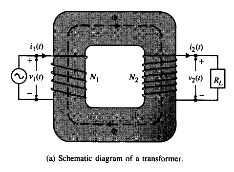

**Real Transformer**
$$
v_{1}=L_{1} \frac{d i_{1}}{d t}-L_{12} \frac{d i_{2}}{d t} \\
v_{2}=L_{12} \frac{d i_{1}}{d t}-L_{2} \frac{d i_{2}}{d t}
$$
where
$$
L_{1} =\frac{\mu S}{\ell} N_{1}^{2} \\
L_{2} =\frac{\mu S}{\ell} N_{2}^{2} \\
L_{12} =\frac{\mu S}{\ell} N_{1} N_{2}
$$

$$
L_{12}=k \sqrt{L_{1} L_{2}}, \quad k<1,
$$

where $K$ is called the **coefficient of coupling**.

$$
\begin{aligned}
&\text { Maxwell's Equations }\\
&\begin{array}{|lll|}
\hline \text { Differential Form } & \text { Integral Form } &  {\text { Significance }} \\
\hline \mathbf{\nabla} \times \mathbf{E}=-\frac{\partial \mathbf{B}}{\partial t} & \oint_{c} \mathbf{E} \cdot d \ell=-\frac{d \Phi}{d t} \quad \text { Faraday's law } \\
\mathbf{\nabla} \times \mathbf{H}=\mathbf{J}+\frac{\partial \mathbf{D}}{\partial t} & \oint_{c} \mathbf{H} \cdot d \ell=I+\int_{s} \frac{\partial \mathbf{D}}{\partial t} \cdot d \mathbf{s} & \text { Ampère's circuital law } \\
\mathbf{\nabla} \cdot \mathbf{D}=\rho & \oint_{s} \mathbf{D} \cdot d \mathbf{s}=Q \quad \text { Gauss's law } \\
\mathbf{\nabla} \cdot \mathbf{B}=0 & \oint_{s} \mathbf{B} \cdot d \mathbf{s}=0 & \text { No isolated magnetic charge } \\
\hline
\end{array}
\end{aligned}
$$
